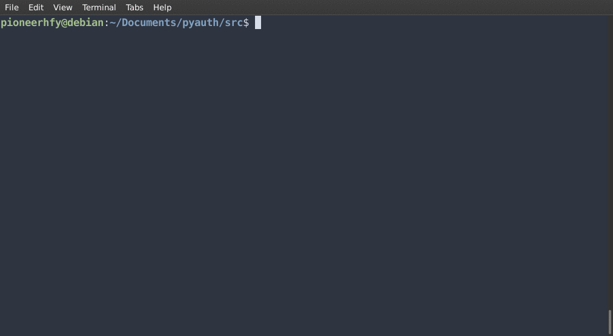

# Pyauth
Monitor your login attemps in linux with pyauth

## What is Monitoring?
Log monitors are a type of software that monitor log files. Servers, application, network and security devices generate log files. Errors, problems, and more information is constantly logged and saved for analysis.

In order to detect problems automatically, system administrators and operations set up monitors on the generated logs. The log monitors scan the log files and search for known text patterns and rules that indicate important events. Once an event is detected, the monitoring system will send an alert, either to a person or to another software/hardware system. Monitoring logs help to identify security events that occurred or might occur.

## Features

- Monitor multiple log files continuously
- SSH Parsing
- Postgresql Parsing
- FTP parsing
- Centos, debian and ubuntu support
- Flexible configuration with YAML support

## Installing

```
- sudo apt-get install python3-pip
- git clone https://github.com/pioneerhfy/pyauth.git
    - cd pyauth && sudo pip3 install -r requirements.txt
```
## Examples

```
sudo python3 src/pyauth.py
```



## Author
* **Hakan İlbiz**

## License

This project is licensed under the GNU GPL v3.0 License - see the [LICENSE](./LICENSE) file for details


